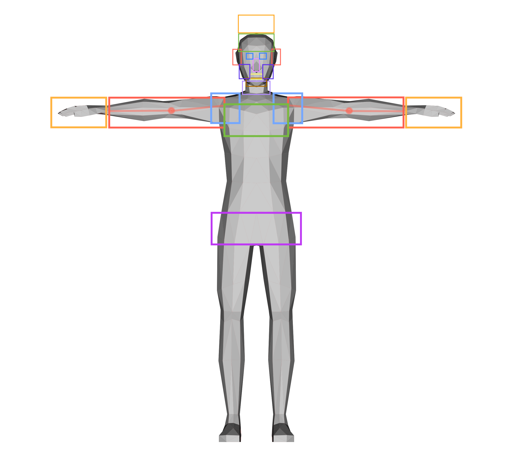

# mbohacek – CVPR SLR ChaLearn

### Locations

In the resulting soft vector, the scores for following locations can be found at the corresponding index within the Tensor.

| Index | Area                          |
|-------|-------------------------------|
| 0     | Neutral space (fallback)      |
| 1     | Above head                    |
| 2     | Upper part of the face        |
| 3     | Eyes                          |
| 4     | Nose                          |
| 5     | Mouth                         |
| 6     | Lower part of the face (chin) |
| 7     | Cheeks                        |
| 8     | Ears                          |
| 9     | Neck                          |
| 10    | Shoulders                     |
| 11    | Chest                         |
| 12    | Waist                         |
| 13    | Arm                           |
| 14    | Wrist (the other hand)        |

### Arm symmetry
